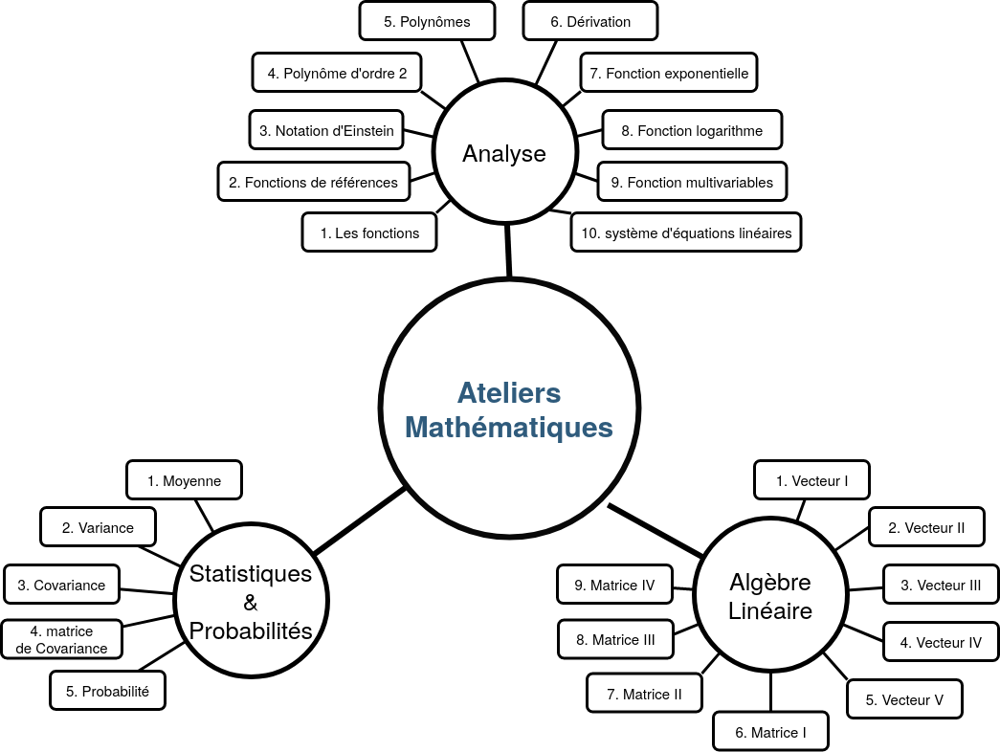
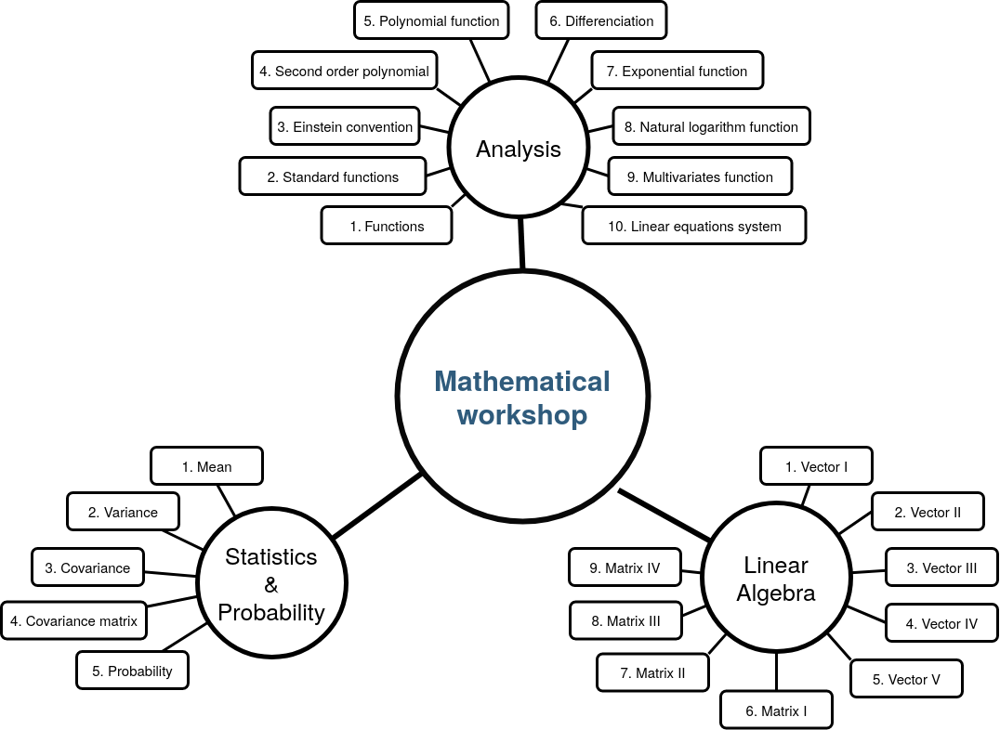

  

<h3 align="center">
  <b>You</b> : <i>"Why we should learn all of these maths stuffs ?"</i> 
  <b>Teacher</b> : <i>"Because it in the syllabus..."</i> 
  <i>(You, during a sunny afternoon of your schooling)</i>
</h3>

# Mathematics Activities

*(english below)*\
Bienvenue sur le répertoire regroupant la production et ressources liés aux mathématiques de  de [**42 AI**](http://www.42ai.fr).\
La production est divisée en 3 catégories:
* Ateliers maths,
* Rendez-vous maths,
* Ressources

Welcome on the repository dedicated to the mathematical creations of [**42 AI**](http://www.42ai.fr).\
The repository is divided into 3 parts:
- Mathematics workshops,
- Mathematics rendez-vous,
* Ressources.

## Table of contents
- [Ateliers mathematiques (fr)](#ateliers\ mathématiques)/[Mathematics workshops](#mathematics\ workshops)
- [Rendez-vous mathématiques](#rendez-vous\ mathématiques)/[Mathematics rendez-vous](#mathematics\ rendez-vous)

## Ateliers mathématiques

Les ateliers mathématiques s'adressent en premier lieu aux personnes **ayant des difficultés en maths** ou **souhaitant se refamiliariser avec les maths**, pour aborder le  machine learning ou bien uniquement pour le plaisir de refaire des mathématiques.

Ces ateliers couvrent les bases de l'analyse, de l'algèbre linéaire et des statistiques qui sont abordées au lycée et va même un peu au delà concernant l'algèbre.\
Ces différents sujets constituent un socle qui nous semble essentiel pour faire du machine learning sans se perdre dans les aspects mathématiques du domaine.

### Quels sont les objectifs ?
- Se réconcilier avec les mathématiques ou rafraîchir nos compétences en mathématiques,
- Acquérir les notions de mathématiques suffisantes pour faire du machine learning,
- Partager, expliquer, de demander des explications sur les mathématiques que ça soit dans l'optique de faire du machine learning ou non.

### Quels est le programme ?
Concernant le programme il y a de l'analyse, de l'algèbre linéaire et un peu de statistiques.
- En analyse, vous passerez du temps à voir ou revoir ce qu'est une fonction, quels sont les fonctions de base, comment dériver ces fonctions, comment manipuler et quelles sont les propriétés des fonctions exponentielle et logarithme et vous terminerez par les fonctions multi-variables et comment les dériver.
- En algèbre, vous appréhendrez la notion de vecteur, comment manipuler des vecteurs. Vous verrez également ce qu'est une matrice et quelles sont les différentes opérations faisant intervenir des matrices.
- En statistiques, on s'intéressera à la notion de moyenne, variance et covariance.
i
Les notions sont présentés de manière à ce que vous les compreniez au mieux dans le cadre où nous allons les utiliser: le machine learning. Pour ceux qui ont un bagage mathématiques bien développer, les approximations où les oublies sont voulus afin de ne pas saturer la compréhension.

  

### Quand ?
* **Printemps 2020:** Les ateliers mathématiques sont  un RDV hebdomadaire qui débutera le lundi ~~27 avril~~ **04 mai**, de 17h30 à 19h30.

## Rendez-vous mathématiques

Si vous avez la <i>bosse des maths</i>, venez partager votre passion et rencontrer des gens pour aller plus loin et progresser.

Les rendez-vous mathématiques s'adresse à tous les curieux et/ou passionnés de mathématiques.
Durant ces rendez-vous sera aborder des sujets très divers en lien ou nom avec le domaine de l'IA.
Les participants sont appelés à partager des connaissancces ou des compétences mathématiques qu'ils souhaitent.

Les rendez-vous mathématiques sont donc par nature, d'un niveau *"intermédiaire"* ou *"avancée"*.

### Quels sont les objectifs ?
- Partager et d'approfondir des notions mathématiques et sa passion pour le domaine,
- Acquérir des notions "avancées" de mathématiques en lien avec le ML, DL ou autre.

### Quand ?
* **Pas de rendez-vous prévus pour l'instant (date: avril 2020)**.

## Mathematics workshops

In first place, the mathematics workshop are adressed to people having difficulties with the basics notions in mathematics or people who whished to reacquaint with mathematics and who planned to study machine learning afterwards.

The mathematics workshops deal with the basics of the analysis, linear algebra and statistics which are learnt during high school.\
We will push a bit further for linear algebra and strart to learn specific notions to machine learning.

We think these differents notions make the mathematical base to learn and practise machine learning without to get in trouble with maths aspects.

### What are the goals ?
- To bring you and maths back together or get a refresher,
- To learn the basics of mathematics to start machine learning,
- To share, explain and ask help about explanations concerning maths.

### Syllabus

- For the analysis part, you will learn what is a function, study some "common" functions, how to differentiate those functions, how to manipulate and what are the properties of the exponential and natural logarithm functions. You will finish with multivariate function and how to differentiate it with respect to each variables.
- For linear algebra part, you will lean what is a vector and how to manipulate it. You will tackle the matrices also and learn some operations using matrices.
- Finally in the statistics part, we will be interested in the mean, the variance and covariance notions.

  

### When ?
* **Spring 2020:** The mathematics workshops will take place every monday starting from ~~April 27th~~ **May the 4th** at 5:30 pm to 7:30pm (disclamer: Speech will be in french).

**Note:** For the moment (April 24th) all the sheets are in french, they will be translated very soon (for monday, you will have enough materials). 

## Mathematics rendez-vous

If you are a whiz at Math, please share your passion and come to meet enthusiasts like you.

The mathematics rendez-vous are for those who are curious or passionate about maths.
Very different subjects concerning mathematics can be treated, related or not with AI.
Participants are invited to share and explain knowledges.

By nature, the rendez-vous are *"intermediate"* or *"adance"* level.

### What are the goals ?
- To share our knowleges and deal with mathematics in depth,
- To Express your passion about the mathematics, 
- To learn 'intermediate' or 'advanced' skills in maths related to ML, DL or any other fields.

### When ?
* **No 'rendez-vous' planned for the moment (date: April 2020)**.

## Ressources
Dans le répertoire *Ressources* vous trouverez:
* Une liste de liens vers des vidéos, articles ou MOOC traitant des notions mathématiques abordées dans les ateliers mathématiques, rendez-vous mathématiques ou bien parce que les ressources ont été jugées pertinentes ou particulièrement bien expliquées.
* Un archivage des différentes productions réalisées par le passé.

# Fonctionnement du dépôt

Ce dépôt est là pour encourager la collaboration et l'échange. Un peu à la manière d'un wiki, le but est de l'alimenter avec des _markdown_ créées par les contributeurs et de le maintenir à jour en apportant des corrections, exercices, liens vers des ressources et tout ce qui vous paraîtra approprié pour vous faire progresser et faire progresser les autres.

Pour contribuer vous pouvez utiliser tous les outils mis à disposition par Github : _pull requests_, _issues_, etc. Par exemple, n'hésitez pas à ouvrir une _issue_ pour signaler une erreur et en débattre. Veillez à mettre des commentaires explicites pour les _commits_.

