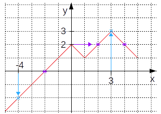

# Feuille d'exerices 1: Notion de fonction

## Objectifs:
L'objectif principal de cette série d'exerices est de vous familiariser avec le vocabulaire autour des fonctions.

## :pencil2: :page_with_curl: Exercice 1: Image et antécédant(s) 
Le but de l'exercice est que vous vous entraîniez à différencier la notion d'image et d'antécédants.
De même pour la notion d'ensemblde de définition et l'ensemble image d'une fonction.\
*Exemple:*
<p align="center">

</p>

- L'image de 3 par la fonction f est 3.
- L'image de -4 par la fonction f est -2.
- L'antécédant de 0 est -2.
- Les antécédants de 2 sont 0, 2, 4.
- Le domaine de définition de la fonction est l'intervalle [-5;5] (on voit que x ne peut prendre que des valeurs entre -5 et 5 sur l'axe des abscisses).
- Le domaine image de la fonction est l'intervalle [-3;3] (on remarque que la fonction f prend des valeurs comprise entre -3 et 3 sur l'axe des ordonnées).

À vous de jouer !
Soient les fonctions g et h dont les représentations graphiques sont représentées sur la figure ci-dessous.

<p align="center">

</p>

1. Donner les images de -4, -2, 0 et 3 par les 2 fonctions.
2. Donner les antécédants de -2, 0 et 2 pour les 2 fonctions.
3. Quels sont les domaines de définition et images des 2 fonctions g et h.


## :pencil2: :page_with_curl: Exercice 2: expression algébrique et représentation graphique 
Dans cette exercice, vous allez caclculer des images de différentes fonctions à partir des expréssions algébriques et tracer leurs représentations graphiques.

---
*Exemple:*\
Soit la fonction f définie sur $\mathbb{R}$:
$$
\begin{matrix}
   & \mathbb{R}   &     & \mathbb{R} \\
f :&     x      & \mapsto & 3x-5 
\end{matrix}
$$
Ici vous avez une notation formelle et très mathématiques, mais elle contient toutes les informations. Le premier $\mathbb{R}$ au dessus du $x$ correspond au domaine de définition, le second correspond au domaine image de la fonction.
La variable est $x$ et l'expression algébrique se déduit de l'expression de droite $3x-5$:
$$
f(x) = 3x-5
$$
Si nous désirons connaître l'image de 3 par f, il faut alors substituer (le terme souvent utiliser en maths est injecter) 3 dans l'expression (à la place de x):
$$
\begin{matrix}
& f(3) & = & 3\times(3) - 5 \\
\Leftrightarrow & f(3) & = & 9 - 5 \\
\Leftrightarrow & f(3) & = & 4
\end{matrix}
$$
En calculant plusieurs images de la fonction f on peut observer la tendance de ses variations et construire un tableau de valeurs:

|  x   |-3  | -2 |-1 |  0 |  1 | 2 | 3 |
|:----:|:--:|:--:|:-:|:--:|:--:|:-:|:-:|
| f(x) |-14 |-11 |-8 | -5 | -2 | 1 | 4 |

Ce tableau de valeurs permet ensuite de placer ces points (coordonnées ($x$,$f(x)$)) de la fonction dans un repère:

<p align="center">

</p>

---

À vous de jouer !\
Soient les fonctions g et h dont les expressions algébriques sont données ci-dessous:
$$
\begin{matrix}
& \mathbb{R} & & \mathbb{R} \\
g : & x & \mapsto & -\frac{1}{2}x + 3\\
h : & x & \mapsto & 2x + 1\\
\end{matrix}
$$

0. Donner l'expression algébrique de la fonction g et de la fonction h.
1. Donner le tableau de valeurs de ces 2 fonctions pour x appartenant à $\{-5; -4; -3; -2; -1; -\frac{1}{2}; 0; 1; \frac{3}{2}; 2; 3; 4; 5\}$
2. Tracer les représentations graphiques de ces 2 fonctions.
3. Par lecture graphique, quels sont les coordonnées du point d'intersection ?

L'intersection entre 2 courbes de fonctions se caractérise de manière algébrique par l'égalité entre les 2 fonctions:
$$
h(x_i) = g(x_i)
$$
On peut alors substituer les fonctions par leurs expressions et simplifier l'équation afin de déterminer la valeur de $x_i$:
$$
-\frac{1}{2}x_i+3 = 2x_i+1\\
\Leftrightarrow -\frac{1}{2}x + 3 -1 = 2x_i + 1 -1\\
\Leftrightarrow -\frac{1}{2}x + 2 = 2x_i\\
\Leftrightarrow -\frac{1}{2}x + 2 + \frac{1}{2}x_i = 2x_i + \frac{1}{2}x_i\\
\Leftrightarrow 2 = (2+\frac{1}{2})x_i\\
\Leftrightarrow 2 = \frac{5}{2}x_i \\
\Leftrightarrow x_i = 2\times \frac{2}{5} = \frac{4}{5}
$$

4. Déterminer par le calcul, les coordonnées du points d'intersection (je vous encourage à refaire le calcul vous même).

**Note:** Vous vous frotterez plus longuement aux systèmes d'équations lorsque vous serez à la dernère fiche d'analyse.


## :snake: Exercice 3 : Coding time !
Dans cet exercice vous n'aurez plus besoin de vos crayons et de vos feuilles, il est temps de passer à l'application avec python.

### Partie 1: Images
Comme vous l'avez vu dans le premier exerice, l'antécédant et l'image sont, en très gros (ça va faire mal aux mathématiciens de lire ça), respectivement l'input et l'ouput de la fonction.

Pour calculer les images d'un ensemble X de valeurs, vous savez très probablement le faire.\
Quatre options (au moins) s'offrent à vous:
* Les opérations avec les listes,
* la compréhension de liste,
* la fonction lambda,
* les opérations avec les arrays de numpy

**Votre tâche est** de calculer les images des valeurs au sein de la liste $X$, pour les fonctions suivantes:
$$
f(x) = 5x -20\\
g(x) = -7x -3 \\
h(x) = \frac{7}{5}x -11
$$

La liste $X$ est $\{ -10, -9, -8, ..., 8, 9, 10\}$.

```python
funct = lambda x : "expression de la fonction"
Im = map( funct(x) for x in [-2, -1, 0, 1, 2])
```
Cette manière de faire sera pertinente lorsque l'on regardera les fonctions à plusieurs variables mais vous pouvez l'utiliser tout de même si vous le souhaité.

### Partie 2: Antécédants
Si l'on souhaite s'intéresser aux antécédants, c'est, à l'inverse de trouver des images, plus compliqué.

Il vous faut raisonner à partir de l'expression algébrique.

---
*Exemple:*\
Soit la fonction $f_1 = 8x-10$, imaginons que vous souhaitez déterminer la valeur de x pour laquelle la fonction vaut 4.\
Vous pouvez alors écrire l'éqution suivante:
$$
4 = f_1(x_s)  = 8x_s-10 \\
\Leftrightarrow 4 = 8x_s - 10 \\
$$
Vous réarrangez ensuite l'équation et obtenez:
$$
8x_s - 14 = 0 \\
$$
(soustraction de part et d'autre par 4).\
Vous résolvez ensuite cette équation et vous obtenez $x_s = \frac{7}{4}$.

---

En python, vous pouvez utiliser la librairie **Numpy** ou **Sympy** pour résoudre des systèmes d'équations linéaires, notamment avec:
* ```linalg.solve()``` pour Numpy,
* ```solve()``` ou ```solveset()``` pour Sympy.

**Note:**
Prenez le temps de parcourir la page  sur le [solver de Sympy](https://docs.sympy.org/latest/modules/solvers/solvers.html#algebraic-equations).

Pour cette partie, vous devez pour chacune des fonctions $f$, $g$ et $h$, calculer les antécédants des éléments de la liste $Y$:
```python
Y = [-25, 13, -42, 42, 21, 19, 1, 0, 3/2]
```
Faites cela proprement et coder une fonction qui vous retourne les solutions.
*(Vous pourriez être intéressé par le module ```Eq()``` de Sympy).*

### Partie 3: Représentation graphique

Enfin, vous allez demander à python de représenter les fonctions que vous souhaitez.\
Pour cela, rien de tel que le module ```matplotlib.pyplot```.

Votre boulot est de représenter l'ensemble des fonctions présent dans ce sujet, laissez votre côté artiste s'exprimer :
* ```plot(X, Y, color = "...", linewidth = ..., marker = ".", ...)```
* ```scatter(X, Y, ...)```
* ```subplot()```

Explorer la page de [matplotlib](https://matplotlib.org/3.1.1/gallery/index.html).